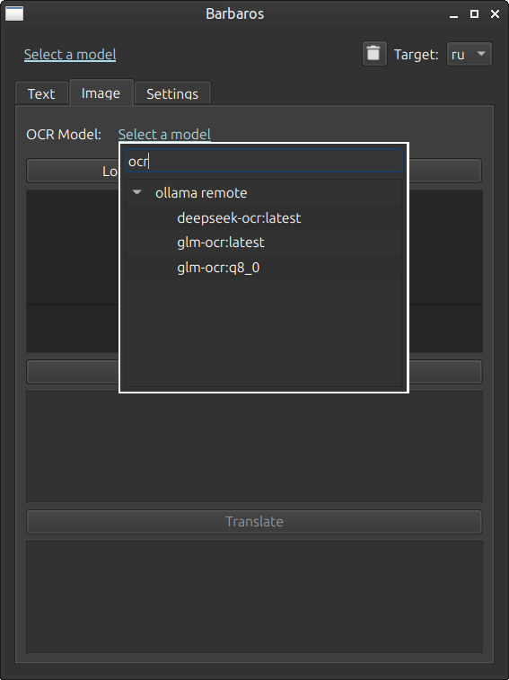
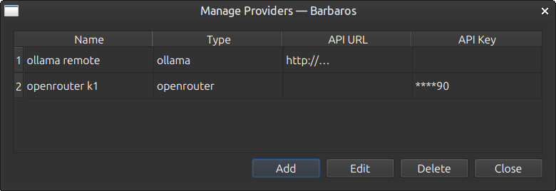
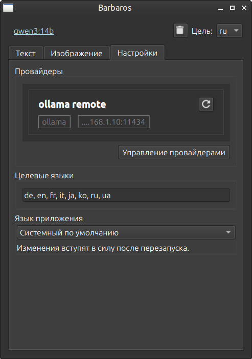
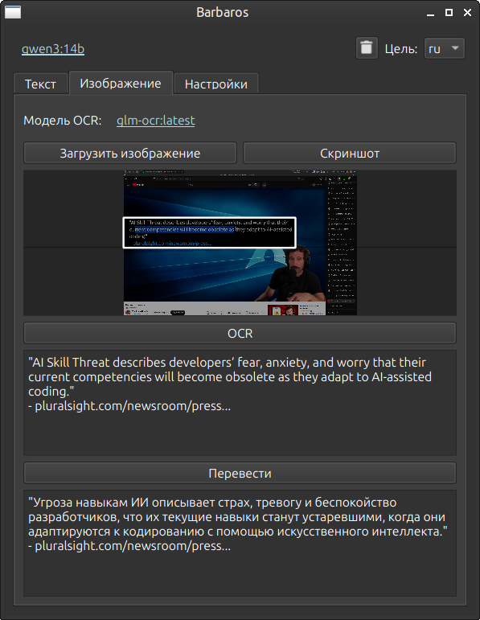
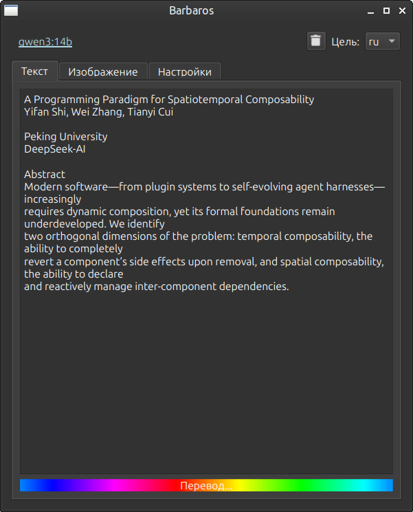
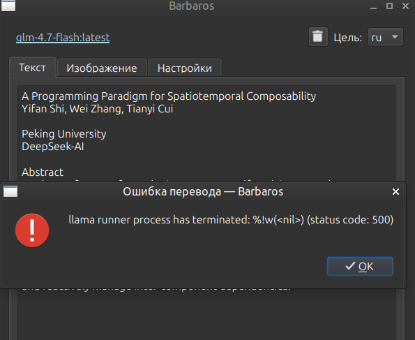
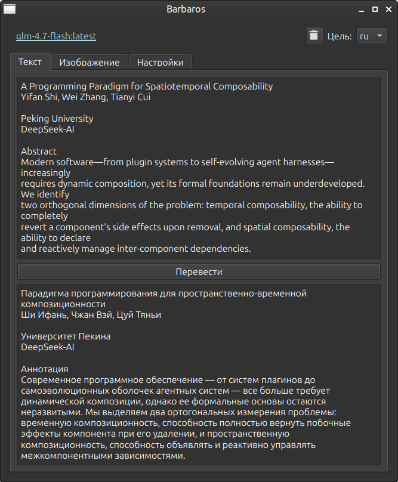
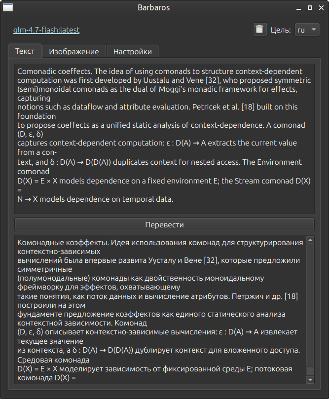

# Barbaros

[Русская документация](docs/README_RU.md)

**AI-Powered Translation Desktop Application**

Barbaros is a lightweight desktop application that provides instant AI translations through your system tray. Simply copy text to your clipboard and get quick translations with a hotkey.
> **Note:** Tested only on Linux, but may also work on Windows and macOS.

## Gallery

| Model Selector | Manage Providers | Settings |
| :---: | :---: | :---: |
|  |  |  |

| OCR | Translation Process | Error |
| :---: | :---: | :---: |
|  |  |  |

| Text 1 | Text 2 |
| :---: | :---: |
|  |  |


## Features

- **🚀 System Tray Integration**: Runs quietly in the background without cluttering your desktop
- **📋 Clipboard Translation**: Automatically translates text from your clipboard
- **🖼️ OCR Functionality**: Text recognition from images with screen capture and cropping support
- **🌐 UI Localization**: Interface available in English and Russian
- **🤖 AI-Powered**: Leverages advanced AI models through multiple LLM providers (Ollama, OpenAI, Anthropic, and 40+ others) for accurate translations
- **🎯 Separate Models for OCR**: Ability to choose a dedicated model for text recognition from images
- **🔒 Privacy-First**: Process translations locally with Ollama or securely with cloud providers (your data protection depends on chosen provider)
- **🏠 Offline Capable**: Works completely offline with local providers (e.g., Ollama) once models are downloaded
- **⚡ Quick Access**: Instant popup with customizable hotkeys

## Prerequisites

Barbaros uses the [any_llm](https://github.com/mozilla-ai/any-llm) SDK to support 40+ different LLM providers. You can choose to work with local providers like Ollama or cloud providers like OpenAI, Anthropic, and others.

### Local Provider: Ollama (Default)

Barbaros comes with Ollama pre-configured as the default provider. For local, privacy-focused translations, install [Ollama](https://ollama.ai/):

**Linux Installation:**
```bash
curl -fsSL https://ollama.com/install.sh | sh
```

**Pull a Translation Model:**
After installing Ollama, download a model for translations:
```bash
ollama pull llama3.1
```

Browse available models in the [official Ollama catalog](https://ollama.com/search).

### Cloud Providers

For cloud providers, you'll need:
- **API Key**: Get an API key from your chosen provider's website
- **Model Access**: Ensure you have access to the desired models

Popular cloud providers include:
- **OpenAI**: Requires [API key](https://platform.openai.com/api-keys)
- **Anthropic**: Requires [API key](https://console.anthropic.com/)
- **Google Gemini**: Requires [API key](https://ai.google.dev/)
- **And 40+ more** supported by any_llm

> **Note**: Cloud providers send your text to their servers. Review their privacy policies before use.

## Installation

### Option 1: Flatpak Package (Recommended)

**Download and Install:**
1. Get the latest `.flatpak` file from [GitHub Releases](https://github.com/FRiMN/barbaros/releases)
2. Install the package:
   ```bash
   cd ~/Downloads
   flatpak install Barbaros-v1.2.3.flatpak
   ```

**Launch:**
- **Terminal**: `flatpak run io.github.frimn.barbaros` or `flatpak run io.github.frimn.barbaros --opened` for open main window on startup
- **GUI**: Find "Barbaros" in your application menu

**Quick Translation:**
```bash
flatpak run io.github.frimn.barbaros --popup
```
*Tip: Bind this command to a keyboard shortcut for instant access*

> **Note:** Manual Flatpak installation doesn't support automatic updates. Check GitHub releases for new versions.

### Option 2: Development Installation

**Clone and Setup:**
```bash
git clone https://github.com/FRiMN/barbaros.git
cd barbaros
uv sync
```

**Run Application:**
```bash
# Start system tray application
uv run barbaros

# Quick translation popup
uv run barbaros --popup

# Start app with open main window without translation
uv run barbaros --opened
```

## Usage

### Text Translation

1. **Start the Application**: Launch Barbaros to run it in your system tray
2. **Select Provider and Model** (optional):
   - Open the application window
   - In the "Text" tab, select a provider and model from the dropdown
   - Default: Ollama with your first available model
3. **Configure Providers** (optional):
   - Go to "Settings" tab
   - Click "Manage Providers" to add/edit/remove providers
   - Click refresh button next to a provider to load available models
4. **Translate Text**:
   - Copy any text you want to translate to your clipboard
   - Use the `--popup` command, or click the system tray icon
   - In the translation window, select target language
   - Press "Translate" button or `Ctrl+Return` shortcut
5. **Get Results**: The translation window will appear with your translated text and performance statistics

### Image Text Recognition (OCR)

Barbaros supports text recognition from images with subsequent translation:

1. **Navigate to "Image" Tab**: In the main application window, select the "Image" tab
2. **Load an Image**:
   - Click "Load Image" button to load an image from disk
   - Or click "Screenshot" button to capture a screen
3. **Select Text Area**:
   - Click on the image preview to open the cropping editor
   - Select the text area you want to recognize
   - Use the corner and side handles for precise area adjustment
   - Use the zoom slider for detailed viewing
4. **Select OCR Model**:
   - From the "OCR Model" dropdown, select a provider and model for text recognition
   - Recommended: vision-capable models like `llava` or specialized OCR models
5. **Start Recognition**:
   - Click "OCR" button to recognize text from the selected area
   - Recognized text will appear in the text field
6. **Translate Recognized Text**:
   - Select target language
   - Click "Translate" button to translate the recognized text
   - Translation result will appear in the bottom text field

### Settings

The "Settings" tab provides configuration for providers, target languages, and the UI language:

- **Target languages**: Set the list of languages offered in the translation language dropdown. Enter a comma-separated list of 2 or 3 character language codes (e.g., `en, de, es, ru`). Invalid characters are rejected, and the list is saved automatically when you finish editing.
- **Language**: Choose the UI language. Select "System default" to follow your operating system's locale, "English", or any other installed language (e.g., Russian). Changes apply after restart.

## Localization

Barbaros supports multiple UI languages through Qt's translation system:

- **English**
- **Russian**

The UI language is auto-detected from your system locale on first launch and can be changed anytime in **Settings → Language**. Adding new languages is supported for developers — see the [localization guide](docs/localization.md).

## Providers

Barbaros supports 40+ LLM providers through the [any_llm](https://github.com/mozilla-ai/any-llm) SDK, giving you flexibility to choose between local and cloud models:

### Default Provider
- **Ollama**: Pre-configured for local, privacy-focused translations

### Supported Providers
The application supports providers including:
- **Local**: Ollama, Llama.cpp, Llamafile, vLLM, LM Studio
- **Major Cloud**: OpenAI, Anthropic, Google Gemini, Azure
- **Specialized**: Groq, Together AI, Cerebras, Fireworks, Sambanova
- **Enterprise**: AWS Bedrock, IBM watsonx, Databricks, Vertex AI
- **And 30+ more**: See [any_llm documentation](https://github.com/mozilla-ai/any-llm) for complete list

### Managing Providers

1. **Open Settings**: Navigate to the "Settings" tab in Barbaros
2. **Manage Providers**: Click the "Manage Providers" button
3. **Add Provider**: 
   - Click "Add Provider"
   - Enter a name (e.g., "My Ollama")
   - Select provider type from dropdown (OpenAI, Anthropic, etc.)
   - Enter API key (required for cloud providers)
   - Enter API URL if using a custom endpoint (optional)
4. **Load Models**: Click the refresh button next to a provider to fetch available models
5. **Select Model**: Choose from provider/model dropdown in Text or OCR tabs

### Provider Configuration Examples

**OpenAI:**
- Type: `openai`
- API Key: Your OpenAI API key from https://platform.openai.com/api-keys
- API URL: Leave blank (uses default)

**Anthropic:**
- Type: `anthropic`
- API Key: Your Anthropic API key from https://console.anthropic.com/
- API URL: Leave blank (uses default)

**Custom OpenAI-compatible endpoint:**
- Type: `openai`
- API Key: Your endpoint's API key
- API URL: `https://your-endpoint.com/v1`

**Ollama (local):**
- Type: `ollama`
- API Key: Leave blank
- API URL: Leave blank (uses `http://localhost:11434` by default)

### Model Selection

Each provider can have multiple models. Select the desired model from the tree view dropdown:
- Provider names are shown as top-level items
- Models appear as children under each provider
- Selection persists between sessions

## How It Works

Barbaros uses a dual-communication system for reliable popup functionality:

- **Primary**: DBus messaging for seamless desktop integration
- **Fallback**: Unix signals (`SIGUSR1`) for reliable operation

### Text Translation

When you use the `--popup` argument, the command communicates with the running application instance, which then:
1. Brings the main window to the foreground
2. Retrieves text from your clipboard
3. Processes the translation through the selected provider and model
4. Displays the results

### Image Text Recognition (OCR)

For OCR functionality, Barbaros uses a separate worker process:

1. **Image Loading**: User loads an image or takes a screenshot
2. **Cropping**: Built-in editor allows precise selection of text area
3. **Model Submission**: Image is converted to PNG and sent to the selected OCR model
4. **Recognition**: Model analyzes the image and returns recognized text
5. **Translation**: Recognized text can be translated using the selected translation model

**Provider Communication:**
- **Local Providers** (e.g., Ollama): Translations and OCR processed offline on your machine
- **Cloud Providers** (e.g., OpenAI, Anthropic): Secure API calls to provider servers
- **Dual-Communication System**: DBus messages + Unix signals for reliable popup functionality

## Dependencies

**Runtime Requirements:**
- [any_llm](https://github.com/mozilla-ai/any-llm) - Unified LLM provider SDK (supports 40+ providers)
- [PySide6](https://www.qt.io/qt-for-python) - GUI framework
- [psutil](https://github.com/giampaolo/psutil) - Process utilities
- [Flatpak](https://flatpak.org/) - Application distribution (optional)

**Optional (for local AI models):**
- [Ollama](https://ollama.ai/) - Local LLM provider (default, pre-configured)

**For OCR Functionality:**
- Compatible vision-capable models (models with image support)
- Recommended models: `glm-ocr` or other multimodal models

**Development Tools:**
- [uv](https://docs.astral.sh/uv/) - Python package management
- [Flatpak](https://flatpak.org/) - Application distribution

## Development

### Building Flatpak Package

For detailed information about building the Flatpak package, see [build_flatpak.md](docs/build_flatpak.md).

### Application Versioning

For details on how the application version is generated (setuptools_scm, CalVer format) and how it is displayed in the About window, see [versioning.md](docs/versioning.md).

**Quick Build:**
We use **[invoke](https://docs.pyinvoke.org/en/stable/)** for the build process. See the `tasks.py` file in the project root.
```bash
uv run invoke build
```

## Translation Quality Disclaimer

**Important Notice**: The quality of translations depends entirely on the AI model you choose and its capabilities. Barbaros is a tool that facilitates the translation process, but it does not guarantee the accuracy, completeness, or appropriateness of translations.

- Translation accuracy varies between different language pairs
- Complex technical, legal, or medical texts may require professional human translation
- Always review and verify translations for important documents
- The application is not responsible for any consequences resulting from translation errors

For critical translations, we recommend consulting professional translation services.

## Contributing

Contributions are welcome! Please feel free to submit issues and pull requests.

## License

This project is open source. Please check the repository for license details.
