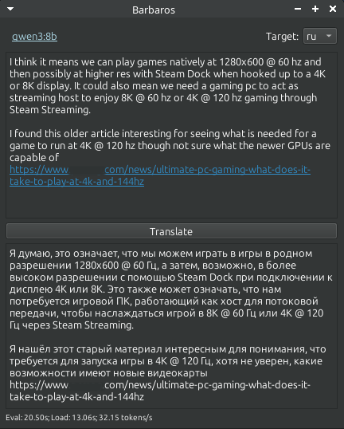
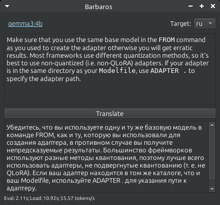

# Barbaros

AI Translation App

Barbaros is a desktop application for quick translations using AI. It runs in the system tray and can be quickly invoked to translate text from your clipboard.

## Screenshots





## Features

- **System Tray Integration:** Runs unobtrusively in the system tray.
- **Clipboard Translation:** Automatically picks up text from the clipboard for translation.
- **AI-Powered:** Uses AI models for translation.
- **Fast Popup:** Can be quickly opened with a command or a hotkey.

## For developers

Information about how build flatpak-package can be found in the [build_flatpak.md](docs/build_flatpak.md) file.

Automated build script: [build.sh](build.sh).

## Installation & Usage

### Ollama

This application requires [ollama](https://ollama.ai/) to be installed and running. To install ollama, follow the instructions for your operating system on the [ollama website](https://ollama.ai/).

On Linux, you can install it with the following command:
```bash
curl -fsSL https://ollama.com/install.sh | sh
```

After installation, you need to pull the model that you want to use. For example, to use the `llama3.1` model, run:
```bash
ollama pull llama3.1
```

You can find available models in [official catalog](https://ollama.com/search).

### Barbaros

**Manual Flatpak Installation**

This section explains how to manually install Barbaros using a downloaded Flatpak package. Unlike a repository installation, this method requires you to manually update the application by downloading new versions from GitHub.

*Note:* This method does not support automatic updates. You will need to manually install new `.flatpak` files from future releases.

Installation Steps:

1. Download the Package:
Get the latest `.flatpak` file from the Barbaros [releases page on GitHub](https://github.com/FRiMN/barbaros/releases).

2. Run the Installation Command:
Open a terminal, navigate to the directory where you downloaded the file, and run the following command. Replace Barbaros-v1.2.3.flatpak with the actual filename.
```bash

cd ~/Downloads
flatpak install Barbaros-v1.2.3.flatpak
```

3. Launch the Application:
Once installed, you can start Barbaros in one of two ways:
- *Terminal*: Execute `flatpak run io.github.frimn.barbaros`
- *Graphical Menu*: Look for "Barbaros" in your application launcher or desktop menu.

4.  Translate text via clipboard:
Copy any text to your clipboard and then run:
```bash
flatpak run io.github.frimn.barbaros --popup
```
This will open the main window and start the translation. It is recommended to bind this command to a keyboard shortcut for quick access.

**Installation through repository clone**

1.  Clone the repository:
```bash
git clone https://github.com/FRiMN/barbaros.git
cd barbaros
```

2.  Install dependencies using uv:
```bash
uv sync
```

3.  Run the application:
```bash
uv run barbaros
```
The application will start in the system tray.

4.  Translate text via clipboard:
Copy any text to your clipboard and then run:
```bash
uv run barbaros --popup
```
This will open the main window and start the translation. It is recommended to bind this command to a keyboard shortcut for quick access.

## How It Works

When the `--popup` argument is used, the script sends a signal to the already running application instance. Upon receiving the signal, the application brings its main window to the foreground, takes the text from the clipboard, and performs the translation.

The application uses two independent communication mechanisms for this popup feature:
- DBus (primary method).
- Unix signals (as a fallback method). In this mode, the application listens for a `SIGUSR1` signal.

## Dependencies

- [ollama](https://ollama.ai/)
- [PySide6](https://www.qt.io/qt-for-python)
- [psutil](https://github.com/giampaolo/psutil)
- For developing and distribution:
  - [uv](https://docs.astral.sh/uv/)
  - [Flatpak](https://flatpak.org/)
