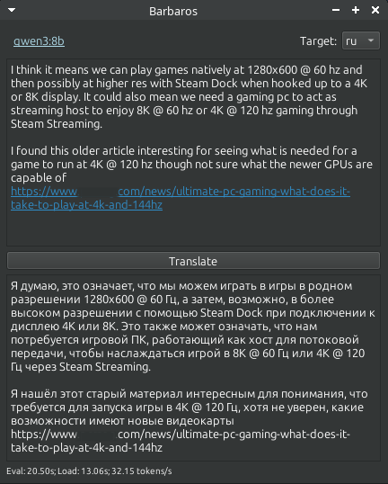
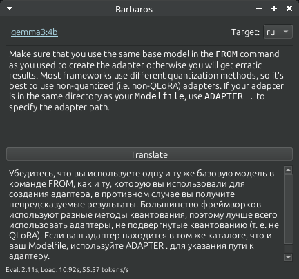

# Barbaros

**AI-Powered Translation Desktop Application**

Barbaros является настольным приложением с поддержкой искусственного интеллекта, которое предоставляет мгновенный перевод через системный трей. Просто скопируйте текст в буфер обмена и получите быстрые переводы с помощью горячей клавиши.





## Особенности

- **🚀 Интеграция с системным треем**: Работает тихо в фоновом режиме, не засоряя рабочий стол
- **📋 Перевод из буфера обмена**: Автоматически переводит текст из вашего буфера обмена
- **🤖 Работа на основе искусственного интеллекта**: Использует передовые модели искусственного интеллекта через Ollama для точных переводов
- **🔒 Конфиденциальность прежде всего**: Все переводы обрабатываются локально - ваши данные никогда не покидают ваш компьютер
- **🏠 Работает в автономном режиме**: Работает полностью в автономном режиме после загрузки моделей
- **⚡ Быстрый доступ**: Мгновенное всплывающее окно с настраиваемыми горячими клавишами
- **🔄 Несколько методов связи**: Использует DBus и Unix сигналы для надежной работы

## Предпосылки

### Установка Ollama

Barbaros требует установки и запуска [Ollama](https://ollama.ai/) в вашей системе.

**Установка в Linux:**
```bash
curl -fsSL https://ollama.com/install.sh | sh
```

**Загрузка модели перевода:**
После установки Ollama загрузите модель для переводов:
```bash
ollama pull llama3.1
```

Ознакомьтесь с официальным каталогом Ollama ([https://ollama.com/search](https://ollama.com/search)) для просмотра доступных моделей.

## Установка

### Вариант 1: Пакет Flatpak (Рекомендуется)

**Загрузка и установка:**
1. Скачайте последний файл `.flatpak` с [GitHub Releases](https://github.com/FRiMN/barbaros/releases)
2. Установите пакет:
   ```bash
   cd ~/Downloads
   flatpak install Barbaros-v1.2.3.flatpak
   ```

**Запуск:**
- **Терминал**: `flatpak run io.github.frimn.barbaros`
- **Графический интерфейс**: Найдите "Barbaros" в меню приложений

**Быстрый перевод:**
```bash
flatpak run io.github.frimn.barbaros --popup
```
*Совет: Назначьте сочетание клавиш для этой команды для мгновенного доступа*

> **Обратите внимание**: Ручная установка Flatpak не поддерживает автоматические обновления. Проверяйте GitHub releases для новых версий.

### Вариант 2: Отладочная установка

**Клонирование и настройка:**
```bash
git clone https://github.com/FRiMN/barbaros.git
cd barbaros
uv sync
```

**Запуск приложения:**
```bash
# Запуск системного трея приложения
uv run barbaros

# Всплывающее окно для быстрого перевода
uv run barbaros --popup
```

## Использование

1. **Запустите приложение**: Запустите Barbaros, чтобы запустить его в системном трее
2. **Скопируйте текст**: Скопируйте любой текст, который вы хотите перевести, в буфер обмена
3. **Переведите**:
   - Используйте команду `--popup`, или
   - Щелкните значок системного трея
4. **Получите результаты**: Появится окно перевода с вашим переведенным текстом

## Как это работает

Barbaros использует систему двойной связи для надежной работы всплывающего окна:

- **Основная**: Сообщения DBus для бесшовной интеграции с рабочим столом
- **Резервная**: Unix сигналы (`SIGUSR1`) для надежной работы

Когда вы используете аргумент `--popup`, команда взаимодействует с работающим экземпляром приложения, который затем:
1. Перемещает главное окно на передний план
2. Получает текст из вашего буфера обмена
3. Обрабатывает перевод через Ollama
4. Отображает результаты

## Зависимости

**Требования времени выполнения:**
- [Ollama](https://ollama.ai/) - бэкэнд модели искусственного интеллекта
- [PySide6](https://www.qt.io/qt-for-python) - фреймворк графического интерфейса
- [psutil](https://github.com/giampaolo/psutil) - доступ к процессам

**Инструменты разработки:**
- [uv](https://docs.astral.sh/uv/) - управление пакетами Python
- [Flatpak](https://flatpak.org/) - сборка и распространение приложений

## Разработка

### Сборка пакета Flatpak

Для получения подробной информации о сборке пакета Flatpak, смотрите [build_flatpak.md](build_flatpak.md).

**Быстрая сборка:**
```bash
./build.sh
```

## Отказ от ответственности за качество перевода

**Важное примечание**: Качество переводов полностью зависит от выбранной вами модели искусственного интеллекта и ее возможностей. Barbaros - это инструмент, который облегчает процесс перевода, но он не гарантирует точность, полноту или уместность переводов.

- Точность перевода варьируется между разными языковыми парами
- Сложные технические, юридические или медицинские тексты могут потребовать профессионального перевода
- Всегда проверяйте и подтверждайте переводы для важных документов
- Приложение не несет ответственности за какие-либо последствия, возникшие в результате ошибок перевода

Для критических переводов рекомендуется обращаться к профессиональным переводческим службам.

## Вклад

Вклад приветствуется! Пожалуйста, не стесняйтесь подавать отчеты об ошибках и отправлять pull requests.

## Лицензия

Этот проект является открытым исходным кодом. Пожалуйста, проверьте репозиторий для получения информации о лицензии.
