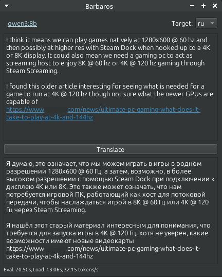
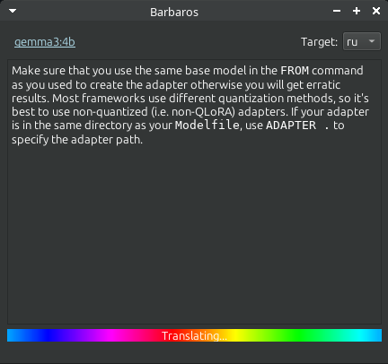
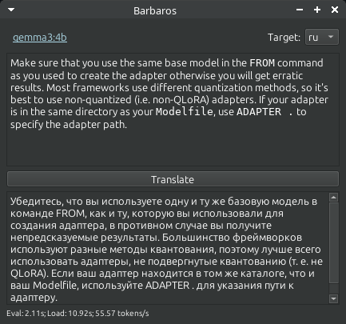

# Barbaros

[English Documentation](../README.md)

**Приложение для перевода на основе ИИ на рабочем столе**

Barbaros — это легковесное приложение для рабочего стола, которое предоставляет мгновенные переводы на основе ИИ через системный трей. Просто скопируйте текст в буфер обмена и получите быстрые переводы с помощью горячей клавиши.
> **Примечание:** Тестировалось только на Linux, но может также работать на Windows и macOS.





## Особенности

- **🚀 Интеграция с системным треем**: Работает тихо в фоновом режиме, не загружая рабочий стол
- **📋 Перевод из буфера обмена**: Автоматически переводит текст из буфера обмена
- **🖼️ OCR-функциональность**: Распознавание текста с изображений с поддержкой захвата экрана и обрезки
- **🌐 Локализация интерфейса**: Интерфейс доступен на английском и русском языках
- **🤖 На основе ИИ**: Использует продвинутые модели ИИ через несколько поставщиков LLM (Ollama, OpenAI, Anthropic и более чем 40 других) для точных переводов
- **🎯 Отдельные модели для OCR**: Возможность выбора отдельной модели для распознавания текста с изображений
- **🔒 Приоритет приватности**: Обработка переводов локально с Ollama или безопасно с облачными поставщиками (защита ваших данных зависит от выбранного поставщика)
- **🏠 Возможность работы без интернета**: Работает полностью офлайн с локальными поставщиками (например, Ollama), как только модели будут загружены
- **⚡ Быстрый доступ**: Мгновенное появление окна с настраиваемыми горячими клавишами
- **🔄 Различные методы связи**: Использует DBus и сигналы Unix для надежной работы
- **🎛️ Три функциональные вкладки**: «Текст» (текстовый перевод), «Изображение» (OCR), «Настройки»

## Предварительные требования

Barbaros использует SDK [any_llm](https://github.com/mozilla-ai/any-llm) для поддержки более чем 40 разных поставщиков LLM. Вы можете выбрать работу с локальными поставщиками, такими как Ollama, или облачными поставщиками, такими как OpenAI, Anthropic и другими.

### Локальный поставщик: Ollama (по умолчанию)

Barbaros поставляется с Ollama, заранее настроенным как поставщик по умолчанию. Для локальных, приватно-ориентированных переводов установите [Ollama](https://ollama.ai/):

**Установка на Linux:**
```bash
curl -fsSL https://ollama.com/install.sh | sh
```

**Загрузите модель для перевода:**
После установки Ollama загрузите модель для перевода:
```bash
ollama pull llama3.1
```

Просмотрите доступные модели в [официальном каталоге Ollama](https://ollama.com/search).

### Облачные поставщики

Для облачных поставщиков вам потребуется:
- **API-ключ**: Получите API-ключ с веб-сайта выбранного поставщика
- **Доступ к модели**: Убедитесь, что у вас есть доступ к нужным моделям

Популярные облачные поставщики включают:
- **OpenAI**: Требуется [API-ключ](https://platform.openai.com/api-keys)
- **Anthropic**: Требуется [API-ключ](https://console.anthropic.com/)
- **Google Gemini**: Требуется [API-ключ](https://ai.google.dev/)
- **И более чем 40 других**, поддерживаемых any_llm

> **Примечание:** Облачные поставщики отправляют ваш текст на их серверы. Перед использованием ознакомьтесь с их политиками приватности.

## Установка

### Вариант 1: Пакет Flatpak (рекомендуется)

**Скачайте и установите:**
1. Получите последний файл `.flatpak` с [GitHub Releases](https://github.com/FRiMN/barbaros/releases)
2. Установите пакет:
   ```bash
   cd ~/Downloads
   flatpak install Barbaros-v1.2.3.flatpak
   ```

**Запуск:**
- **Терминал**: `flatpak run io.github.frimn.barbaros` или `flatpak run io.github.frimn.barbaros --opened` для открытия главного окна при запуске
- **GUI**: Найдите "Barbaros" в меню приложений

**Быстрый перевод:**
```bash
flatpak run io.github.frimn.barbaros --popup
```
*Совет: Свяжите эту команду с горячей клавишей для мгновенного доступа*

> **Примечание:** Ручная установка Flatpak не поддерживает автоматические обновления. Проверяйте GitHub-релизы для новых версий.

### Вариант 2: Установка для разработки

**Клонирование и настройка:**
```bash
git clone https://github.com/FRiMN/barbaros.git
cd barbaros
uv sync
```

**Запуск приложения:**
```bash
# Запуск приложения в системной строке
uv run barbaros

# Быстрый поп-ап для перевода
uv run barbaros --popup

# Запуск приложения с открытым главным окном без перевода
uv run barbaros --opened
```

## Использование

### Перевод текста

1. **Запустите приложение**: Запустите Barbaros, он появится в системном трее
2. **Выберите поставщика и модель** (опционально):
   - Откройте окно приложения
   - Во вкладке «Текст» выберите поставщика и модель из раскрывающегося списка
   - По умолчанию: Ollama с вашей первой доступной моделью
3. **Настройте поставщиков** (опционально):
- Перейдите на вкладку «Настройки»
- Нажмите «Управление провайдерами», чтобы добавить/отредактировать/удалить поставщиков
   - Нажмите кнопку обновления рядом с поставщиком, чтобы загрузить доступные модели
4. **Переведите текст**:
   - Скопируйте любой текст, который хотите перевести, в буфер обмена
   - Используйте команду `--popup`, или щелкните значок в системном трее
   - В окне перевода выберите целевой язык
   - Нажмите кнопку «Перевести» или используйте сочетание клавиш `Ctrl+Return`
5. **Получите результаты**: Окно перевода появится с вашим переведенным текстом

### Распознавание текста с изображений (OCR)

Barbaros поддерживает распознавание текста с изображений с последующим переводом:

1. **Перейдите на вкладку «Изображение»**: В главном окне приложения выберите вкладку «Изображение»
2. **Загрузите изображение**:
   - Нажмите кнопку «Загрузить изображение» для загрузки изображения с диска
   - Или нажмите кнопку «Скриншот» для захвата экрана
3. **Выберите область для распознавания**:
   - На предпросмотре изображения нажмите, чтобы открыть редактор обрезки
   - Выберите область с текстом, которую нужно распознать
   - Используйте ручки по углам и сторонам для точной настройки области
   - Используйте ползунок масштабирования для детального просмотра
4. **Выберите модель OCR**:
   - В раскрывающемся списке «Модель OCR» выберите поставщика и модель для распознавания текста
   - Рекомендуются модели с хорошей поддержкой OCR, например `llava` или специализированные модели
5. **Запустите распознавание**:
   - Нажмите кнопку «OCR» для распознавания текста с выбранной области
   - Распознанный текст появится в текстовом поле
6. **Переведите распознанный текст**:
   - Выберите целевой язык
   - Нажмите кнопку «Перевести» для перевода распознанного текста
   - Результат перевода появится в нижнем текстовом поле

### Настройки

Вкладка «Настройки» предоставляет настройку поставщиков ИИ, целевых языков для перевода и языка интерфейса:

- **Целевые языки**: Задайте список языков, предлагаемых в раскрывающемся списке перевода. Введите список кодов языков из 2 или 3 символов через запятую (например, `en, de, es, ru`). Недопустимые символы отклоняются, а список сохраняется автоматически после завершения редактирования.
- **Язык приложения**: Выберите язык интерфейса. Выберите «Системный по умолчанию», чтобы следовать локали вашей операционной системы, «Английский» или любой другой установленный язык (например, русский). Изменения применяются после перезапуска.

## Локализация

Barbaros поддерживает несколько языков интерфейса через систему перевода Qt:

- **Английский**
- **Русский**

Язык интерфейса автоматически определяется по системной локали при первом запуске и может быть изменен в любое время в **Настройки → Язык приложения**. Добавление новых языков поддерживается для разработчиков — см. [руководство по локализации](localization.md).

## Поставщики

Barbaros поддерживает более чем 40 поставщиков LLM через SDK [any_llm](https://github.com/mozilla-ai/any-llm), предоставляя вам гибкость выбора между локальными и облачными моделями:

### Поставщик по умолчанию
- **Ollama**: Преднастроен для локальных, приватно-ориентированных переводов

### Поддерживаемые поставщики
Приложение поддерживает поставщиков, включая:
- **Локальные**: Ollama, Llama.cpp, Llamafile, vLLM, LM Studio
- **Основные облачные**: OpenAI, Anthropic, Google Gemini, Azure
- **Специализированные**: Groq, Together AI, Cerebras, Fireworks, Sambanova
- **Корпоративные**: AWS Bedrock, IBM watsonx, Databricks, Vertex AI
- **И более чем 30 других**: См. [документацию any_llm](https://github.com/mozilla-ai/any-llm) для полного списка

### Управление поставщиками

1. **Откройте настройки**: Перейдите на вкладку «Настройки» в Barbaros
2. **Управление провайдерами**: Нажмите кнопку «Управление провайдерами»
3. **Добавить поставщика**:
   - Нажмите «Добавить провайдера»
   - Введите имя (например, "My Ollama")
   - Выберите тип поставщика из раскрывающегося списка (OpenAI, Anthropic и т.д.)
   - Введите API-ключ (требуется для облачных поставщиков)
   - Введите URL API, если используете измененный базовый URL к API (опционально)
4. **Загрузите модели**: Нажмите кнопку обновления рядом с поставщиком, чтобы получить доступные модели
5. **Выберите модель**: Выберите из раскрывающегося списка поставщика/модели во вкладках «Текст» или «Изображение»

### Примеры настройки поставщиков

**OpenAI:**
- Тип: `openai`
- API-ключ: Ваш API-ключ OpenAI с https://platform.openai.com/api-keys
- URL API: Оставьте пустым (использует значение по умолчанию)

**Anthropic:**
- Тип: `anthropic`
- API-ключ: Ваш API-ключ Anthropic с https://console.anthropic.com/
- URL API: Оставьте пустым (использует значение по умолчанию)

**Кастомный OpenAI:**
- Тип: `openai`
- API-ключ: API-ключ вашего провайдера
- URL API: `https://your-endpoint.com/v1`

**Ollama (локальный):**
- Тип: `ollama`
- API-ключ: Оставьте пустым
- URL API: Оставьте пустым (по умолчанию используется `http://localhost:11434`)

### Выбор модели

Каждый поставщик может иметь несколько моделей. Выберите нужную модель из раскрывающегося списка:
- Названия поставщиков отображаются как верхние элементы
- Модели появляются как дочерние элементы под каждым поставщиком
- Выбор сохраняется между сессиями

## Как это работает

Barbaros использует двойную систему коммуникации для надежной функции поп-апа:

- **Основной**: Сообщения DBus для бесшовной интеграции с рабочим столом
- **Резервный**: Сигналы Unix (`SIGUSR1`) для надежной работы

### Текстовый перевод

Когда вы используете аргумент `--popup`, команда связывается с запущенным экземпляром приложения, который затем:
1. Приводит главное окно к переднему плану
2. Получает текст из буфера обмена
3. Обрабатывает перевод через выбранный поставщик и модель
4. Отображает результаты

### Распознавание текста с изображений (OCR)

Для функциональности OCR Barbaros использует отдельный рабочий процесс:

1. **Загрузка изображения**: Пользователь загружает изображение или делает снимок экрана
2. **Обрезка**: Встроенный редактор позволяет точно выбрать область с текстом
3. **Отправка модели**: Изображение преобразуется в PNG и отправляется выбранной модели OCR
4. **Распознавание**: Модель анализирует изображение и возвращает распознанный текст
5. **Перевод**: Распознанный текст может быть переведен выбранной моделью перевода

**Коммуникация с поставщиками:**
- **Локальные поставщики** (например, Ollama): Переводы и OCR обрабатываются офлайн на вашем компьютере
- **Облачные поставщики** (например, OpenAI, Anthropic): Безопасные вызовы API к серверам поставщика
- **Двухканальная система коммуникации**: Сообщения DBus + сигналы Unix для надежной функции поп-апа

## Зависимости

**Требования к выполнению:**
- [any_llm](https://github.com/mozilla-ai/any-llm) — унифицированный SDK поставщика LLM (поддерживает более чем 40 поставщиков)
- [PySide6](https://www.qt.io/qt-for-python) — фреймворк GUI
- [psutil](https://github.com/giampaolo/psutil) — утилиты процессов
- [Flatpak](https://flatpak.org/) — распространение приложения (опционально)

**Дополнительные (для локальных моделей ИИ):**
- [Ollama](https://ollama.ai/) — локальный поставщик LLM (по умолчанию, преднастроен)

**Для OCR-функциональности:**
- Совместимые модели с поддержкой изображений (vision-capable models)
- Рекомендуются модели: `glm-ocr` или другие мультимодальные модели

**Инструменты разработки:**
- [uv](https://docs.astral.sh/uv/) — управление пакетами Python
- [Flatpak](https://flatpak.org/) — распространение приложения

## Разработка

### Сборка пакета Flatpak

Для получения подробной информации о сборке пакета Flatpak, смотрите [build_flatpak.md](build_flatpak.md).

### Версионирование приложения

Подробности о том, как формируется версия приложения (setuptools_scm, формат CalVer) и как она отображается в окне «О программе», см. в [versioning.md](versioning.md).

**Быстрая сборка:**
Мы используем **[invoke](https://docs.pyinvoke.org/ru/stable/)** для процесса сборки. См. файл `tasks.py` в корне проекта.
```bash
uv run invoke build
```

## Отказ от ответственности за качество перевода

**Важное уведомление:** Качество перевода полностью зависит от выбранной вами модели ИИ и ее возможностей. Barbaros — это инструмент, который упрощает процесс перевода, но не гарантирует точность, полноту или соответствие переводов.

- Точность перевода варьируется между разными парами языков
- Сложные технические, юридические или медицинские тексты могут требовать профессионального перевода человеком
- Всегда проверяйте и уточняйте переводы для важных документов
- Приложение не несет ответственности за последствия, вызванные ошибками перевода

Для критически-важных переводов рекомендуется обращаться к профессиональным услугам перевода.

## Вклад

Вклад приветствуется! Пожалуйста, не стесняйтесь подавать запросы на улучшение и pull-запросы.

## Лицензия

Этот проект является открытым исходным кодом. Пожалуйста, проверьте репозиторий для получения информации о лицензии.
